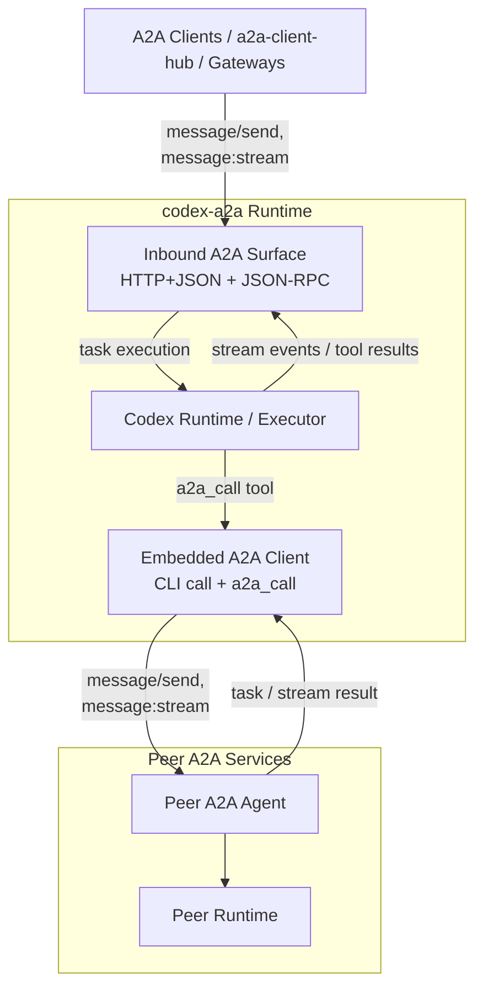

# codex-a2a

> Expose Codex through A2A.

`codex-a2a` adds an A2A runtime layer to the local Codex runtime, with
auth, streaming, session continuity, interrupt handling, a built-in
outbound A2A client, and a clear deployment boundary.

## What This Is

- An A2A adapter service for the local Codex runtime, with inbound runtime
  exposure plus outbound peer calling.
- It supports both roles in one process: serving as an A2A Server and hosting
  an embedded A2A Client for `a2a_call` and CLI-driven peer calls.

## Architecture



## Quick Start

Install the released CLI with `uv tool`:

```bash
uv tool install codex-a2a
```

Upgrade later with:

```bash
uv tool upgrade codex-a2a
```

Install an exact release with:

```bash
uv tool install "codex-a2a==<version>"
```

Before starting the runtime:

- Install and verify the local `codex` CLI itself.
- Configure Codex with a working provider/model setup and any required credentials.
- `codex-a2a` does not provision Codex providers, login state, or API keys for you.
- Startup fails fast if the local `codex` runtime is missing or cannot initialize.

Self-start the released CLI against a workspace root:

```bash
A2A_BEARER_TOKEN="$(python -c 'import secrets; print(secrets.token_hex(24))')" \
A2A_HOST=127.0.0.1 \
A2A_PORT=8000 \
A2A_PUBLIC_URL=http://127.0.0.1:8000 \
A2A_DATABASE_URL=sqlite+aiosqlite:///./codex-a2a.db \
CODEX_WORKSPACE_ROOT=/abs/path/to/workspace \
codex-a2a
```

Agent Card: `http://127.0.0.1:8000/.well-known/agent-card.json`

Authenticated extended card:
- JSON-RPC: `agent/getAuthenticatedExtendedCard`
- HTTP: `GET /v1/card`

## Highlights

- A2A HTTP+JSON endpoints such as `/v1/message:send` and
  `/v1/message:stream`
- A2A JSON-RPC support on `POST /`
- Embedded client access through `codex-a2a call`
- Autonomous outbound peer calls through the `a2a_call` tool
- SSE streaming with normalized `text`, `reasoning`, and `tool_call` blocks
- Session continuity and session query extensions
- Interrupt lifecycle mapping and callback validation
- Transport selection, Agent Card discovery, timeout control, and bearer/basic
  auth for outbound A2A calls
- Payload logging controls, secret-handling guardrails, and released-CLI startup
  / source-based runtime paths

## Boundaries

- Treat the core A2A send / stream / task methods plus Agent Card discovery as
  the portable baseline.
- Treat `codex.*` methods and `metadata.codex.directory` as the Codex-specific
  control plane for Codex-aware clients.
- Treat one deployed instance as a single-tenant trust boundary, not a hardened
  multi-tenant runtime.

The normative compatibility split and deployment model live in
[Compatibility Guide](docs/compatibility.md) and [Security Policy](SECURITY.md).

## When To Use It

Use this project when:

- you want to keep Codex as the runtime
- you need A2A transports and Agent Card discovery
- you want a thin service boundary instead of building your own adapter
- you want inbound serving and outbound peer access in one deployable unit

Look elsewhere if:

- you need hard multi-tenant isolation inside one shared runtime
- you want this project to manage your process supervisor or host bootstrap
- you want a general client integration layer rather than a runtime adapter

## Recommended Client Side

If you want a broader application-facing client integration layer, prefer
[a2a-client-hub](https://github.com/liujuanjuan1984/a2a-client-hub).

It is a better place for higher-level client concerns such as A2A consumption,
upstream adapter normalization, and application-facing integration, while
`codex-a2a` stays focused on the runtime boundary around Codex plus embedded
peer calling.

## Further Reading

- [Usage Guide](docs/guide.md)
  Runtime configuration, outbound access, transport usage, and client examples.
- [Extension Specifications](docs/extension-specifications.md)
  Stable extension URI/spec index plus public-vs-extended card disclosure rules.
- [Architecture Guide](docs/architecture.md)
  System structure, boundaries, and request flow.
- [Compatibility Guide](docs/compatibility.md)
  Supported Python/runtime surface, extension stability, and ecosystem-facing
  compatibility expectations.
- [Security Policy](SECURITY.md)
  Threat model, deployment caveats, and vulnerability disclosure guidance.

## Development

For contributor workflow, validation, release handling, and helper scripts, see
[Contributing Guide](CONTRIBUTING.md) and [Scripts Reference](scripts/README.md).

## License

Apache License 2.0. See [LICENSE](LICENSE).
