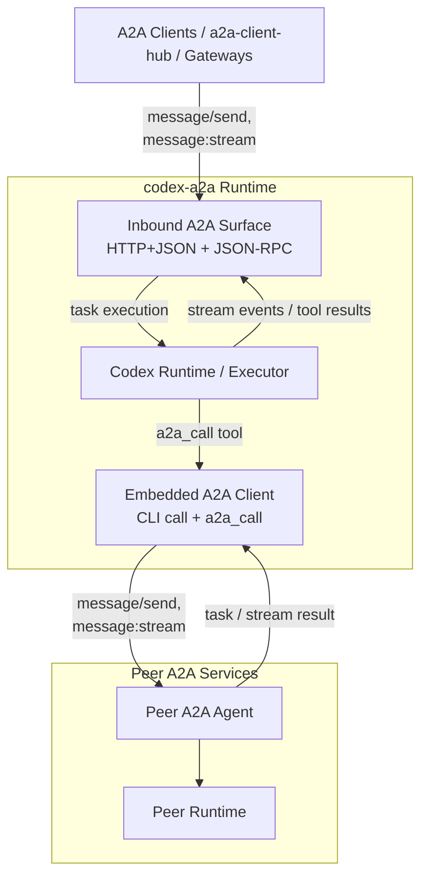

# codex-a2a

> Expose Codex through A2A.

`codex-a2a` adds an A2A runtime layer to the local Codex runtime, with auth, streaming, session continuity, interrupt handling, a built-in outbound A2A client, and a clear deployment boundary.

## What This Is

- An A2A adapter service for the local Codex runtime, with inbound runtime exposure plus outbound peer calling.
- It supports both roles in one process: serving as an A2A Server and hosting an embedded A2A Client for `a2a_call` and CLI-driven peer calls.

## Architecture



For internal module boundaries and maintainer-facing request call chains, see [Maintainer Architecture Guide](docs/maintainer-architecture.md).

## Quick Start

Install the released CLI with `uv tool`:

```bash
uv tool install codex-a2a
```

Upgrade later with:

```bash
uv tool upgrade codex-a2a
```

Install an exact release with:

```bash
uv tool install "codex-a2a==<version>"
```

Before starting the runtime:

- Install and verify the local `codex` CLI itself.
- Configure Codex with a working provider/model setup and any required credentials.
- `codex-a2a` does not provision Codex providers, login state, or API keys for you.
- Startup fails fast if the local `codex` runtime is missing or cannot initialize.

Self-start the released CLI against a workspace root:

```bash
DEMO_BEARER_TOKEN="$(python -c 'import secrets; print(secrets.token_hex(24))')"
A2A_STATIC_AUTH_CREDENTIALS='[{"id":"local-bearer","scheme":"bearer","token":"'"${DEMO_BEARER_TOKEN}"'","principal":"automation"}]' \
A2A_HOST=127.0.0.1 \
A2A_PORT=8000 \
A2A_PUBLIC_URL=http://127.0.0.1:8000 \
A2A_DATABASE_URL=sqlite+aiosqlite:////abs/path/to/workspace/.codex-a2a/codex-a2a.db \
CODEX_WORKSPACE_ROOT=/abs/path/to/workspace \
codex-a2a
```

For the full runtime configuration matrix, outbound client settings, and deployment notes, see [Usage Guide](docs/guide.md).

## Operational Notes

When `A2A_DATABASE_URL` is unset and `CODEX_WORKSPACE_ROOT` is configured, the default SQLite database is created under `${CODEX_WORKSPACE_ROOT}/.codex-a2a/codex-a2a.db`.

On startup, `codex-a2a` auto-creates its own runtime-state tables and applies versioned runtime-state schema migrations in place. This migration ownership currently covers only the adapter-managed `a2a_*` runtime-state tables and intentionally excludes the A2A SDK task-store schema.

YOLO-equivalent startup note:

- `codex-a2a` does not add a separate `--yolo` flag or `YOLO` environment variable.
- To start the underlying Codex process with YOLO-equivalent behavior, set:
  - `CODEX_APPROVAL_POLICY=never`
  - `CODEX_SANDBOX_MODE=danger-full-access`
- `A2A_EXECUTION_*` settings are discovery metadata only and do not change how the Codex subprocess starts.

Agent Card: `http://127.0.0.1:8000/.well-known/agent-card.json`

Authenticated extended card:
- JSON-RPC: `agent/getAuthenticatedExtendedCard`
- HTTP: `GET /v1/card`

Outbound peer auth is configured with `A2A_CLIENT_BEARER_TOKEN` or `A2A_CLIENT_BASIC_AUTH`; see the Usage Guide for the complete client-side matrix.

## When To Use It

Use this project when:

- you want to keep Codex as the runtime
- you need A2A transports and Agent Card discovery
- you want a thin service boundary instead of building your own adapter
- you want inbound serving and outbound peer access in one deployable unit

Prefer **[a2a-client-hub](https://github.com/liujuanjuan1984/a2a-client-hub)** when you need a broader application-facing integration layer or higher-level A2A consumption (see [Ecosystem](#ecosystem) for details).

Look elsewhere if:

- you need hard multi-tenant isolation inside one shared runtime
- you want this project to manage your process supervisor or host bootstrap
- you want a general runtime-agnostic A2A server rather than a Codex adapter

## Highlights

- A2A HTTP+JSON endpoints such as `/v1/message:send` and `/v1/message:stream`
- A2A JSON-RPC support on `POST /`
- Embedded client access through `codex-a2a call`
- Autonomous outbound peer calls through the `a2a_call` tool
- SSE streaming with normalized `text`, `reasoning`, and `tool_call` blocks
- Session continuity and session query extensions
- Interrupt lifecycle mapping and callback validation
- Transport selection, Agent Card discovery, timeout control, and bearer/basic auth for outbound A2A calls
- Payload logging controls, secret-handling guardrails, and released-CLI startup / source-based runtime paths

## Boundaries

Portable vs Private Surface:

- Treat the core A2A send / stream / task methods plus Agent Card discovery as the portable baseline.
- Treat `codex.*` methods plus `metadata.codex.directory` and `metadata.codex.execution` as the Codex-specific control plane for Codex-aware clients.
- Treat one deployed instance as a single-tenant trust boundary, not a hardened multi-tenant runtime.

The normative compatibility split and deployment model live in [Compatibility Guide](docs/compatibility.md) and [Security Policy](SECURITY.md).

## Further Reading

- [Usage Guide](docs/guide.md) Runtime configuration, outbound access, transport usage, and client examples.
- [Extension Specifications](docs/extension-specifications.md) Stable extension URI/spec index plus public-vs-extended card disclosure rules.
- [Architecture Guide](docs/architecture.md) System structure, boundaries, and request flow.
- [Maintainer Architecture Guide](docs/maintainer-architecture.md) Internal module structure, request call chains, and persistence touchpoints for contributors.
- [Compatibility Guide](docs/compatibility.md) Supported Python/runtime surface, extension stability, and ecosystem-facing compatibility expectations.
- [External Conformance Experiments](docs/conformance.md) Manual A2A TCK experiment entrypoint and triage workflow.
- [Security Policy](SECURITY.md) Threat model, deployment caveats, and vulnerability disclosure guidance.

## Ecosystem

`codex-a2a` is part of a growing landscape of A2A-compliant projects. Depending on your architecture, you may find these related projects useful:

### Foundations (Upstream)

- **[A2A Python SDK](https://github.com/Intelligent-Internet/a2a-python)**: The core protocol implementation and SDK used by this adapter.
- **Codex**: The underlying local agent runtime (Proprietary).

### Gateways & Hubs (Vertical Integration)

- **[a2a-gateway](https://github.com/jinyitao123/a2a-gateway)**: Operates at the protocol-bridging layer, sitting between agent platforms and the A2A/MCP ecosystem to handle discovery and routing.
- **[a2a-client-hub](https://github.com/liujuanjuan1984/a2a-client-hub)**: An application-facing integration layer that consumes A2A-compliant instances (like `codex-a2a`) and provides higher-level normalization.

### Alternative Implementations & Runtimes (Horizontal Differences)

- **[MyPrototypeWhat/codex-a2a](https://github.com/MyPrototypeWhat/codex-a2a)**: A lightweight **TypeScript** Express middleware implementation. Ideal for developers looking for in-process SDK integration within a Node.js environment.
- **[opencode-a2a](https://github.com/Intelligent-Internet/opencode-a2a)**: A complementary Python runtime implementation that shares similar protocol patterns and output negotiation practices.

## Development

For contributor workflow, validation, release handling, and helper scripts, see [Contributing Guide](CONTRIBUTING.md) and [Scripts Reference](scripts/README.md). Use that workflow to create a PR from the working branch and merge into `main` after human review.

## License

Apache License 2.0. See [LICENSE](LICENSE).
