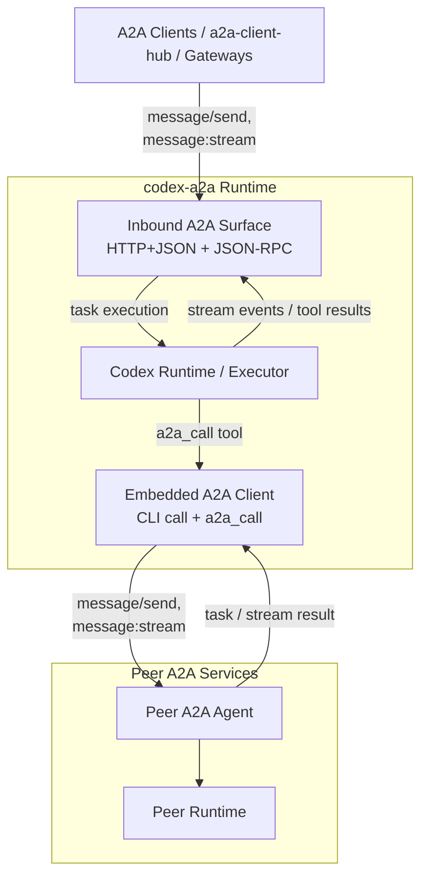

# codex-a2a

> Expose Codex through A2A.

`codex-a2a` adds an A2A runtime layer to the local Codex runtime, with
auth, streaming, session continuity, interrupt handling, a built-in
outbound A2A client, and a clear deployment boundary.

## What This Is

- An A2A adapter service for the local Codex runtime, with inbound runtime
  exposure plus outbound peer calling.
- It supports both roles in one process: serving as an A2A Server and hosting
  an embedded A2A Client for `a2a_call` and CLI-driven peer calls.

## Architecture



## Quick Start

Install the released CLI with `uv tool`:

```bash
uv tool install codex-a2a
```

Upgrade later with:

```bash
uv tool upgrade codex-a2a
```

Install an exact release with:

```bash
uv tool install "codex-a2a==<version>"
```

Before starting the runtime:

- Install and verify the local `codex` CLI itself.
- Configure Codex with a working provider/model setup and any required credentials.
- `codex-a2a` does not provision Codex providers, login state, or API keys for you.
- Startup fails fast if the local `codex` runtime is missing or cannot initialize.

Self-start the released CLI against a workspace root:

```bash
export A2A_BEARER_TOKEN="$(python -c 'import secrets; print(secrets.token_hex(24))')"
A2A_HOST=127.0.0.1 \
A2A_PORT=8000 \
A2A_PUBLIC_URL=http://127.0.0.1:8000 \
CODEX_WORKSPACE_ROOT=/abs/path/to/workspace codex-a2a
```

Agent Card: `http://127.0.0.1:8000/.well-known/agent-card.json`

## Capabilities

- A2A HTTP+JSON endpoints such as `/v1/message:send` and
  `/v1/message:stream`
- A2A JSON-RPC support on `POST /`
- Embedded client access through `codex-a2a call`
- Autonomous outbound peer calls through the `a2a_call` tool
- SSE streaming with normalized `text`, `reasoning`, and `tool_call` blocks
- Session continuity and session query extensions
- Interrupt lifecycle mapping and callback validation
- Transport selection, Agent Card discovery, timeout control, and bearer-token
  auth for outbound A2A calls
- Payload logging controls, secret-handling guardrails, and released-CLI
  startup / source-based runtime paths

Detailed protocol contracts, examples, and extension docs live in
[Usage Guide](docs/guide.md).

## Peering Node / Outbound Access

`codex-a2a` supports a "Peering Node" architecture where one process can both
expose an inbound A2A surface and call peer A2A services outbound.

### CLI Client

Call another A2A agent directly from the command line:

```bash
codex-a2a call http://other-agent:8000 "How are you?" --token your-outbound-token
```

### Outbound Agent Calls

The server can autonomously execute `a2a_call(url, message)` tool calls emitted
by the Codex runtime. Results are fetched through A2A and returned back into
the local execution flow as tool results.

For authenticated peers, configure `A2A_CLIENT_BEARER_TOKEN` for server-side
outbound calls. CLI calls can continue using `--token` or
`A2A_CLIENT_BEARER_TOKEN`.

Server-side outbound client settings are wired through runtime config:
`A2A_CLIENT_TIMEOUT_SECONDS`,
`A2A_CLIENT_CARD_FETCH_TIMEOUT_SECONDS`,
`A2A_CLIENT_USE_CLIENT_PREFERENCE`,
`A2A_CLIENT_BEARER_TOKEN`, and
`A2A_CLIENT_SUPPORTED_TRANSPORTS`.

## When To Use It

Use this project when:

- you want to keep Codex as the runtime
- you need A2A transports and Agent Card discovery
- you want a thin service boundary instead of building your own adapter
- you want inbound serving and outbound peer access in one deployable unit

Look elsewhere if:

- you need hard multi-tenant isolation inside one shared runtime
- you want this project to manage your process supervisor or host bootstrap
- you want a general client integration layer rather than a runtime adapter

## Recommended Client Side

If you want a broader application-facing client integration layer, prefer
[a2a-client-hub](https://github.com/liujuanjuan1984/a2a-client-hub).

It is a better place for higher-level client concerns such as A2A consumption,
upstream adapter normalization, and application-facing integration, while
`codex-a2a` stays focused on the runtime boundary around Codex plus embedded
peer calling.

## Deployment Boundary

This repository improves the service boundary around Codex, but it does not
turn Codex into a hardened multi-tenant platform.

- `A2A_BEARER_TOKEN` protects the inbound A2A surface.
- Provider auth and default model configuration remain on the Codex side.
- Use `A2A_CLIENT_BEARER_TOKEN` for server-side outbound peer calls initiated
  by `a2a_call`.
- One deployed instance should be treated as a single-tenant trust boundary.
- For mutually untrusted tenants, run separate instances with isolated users,
  workspaces, credentials, and ports.

Read before deployment:

- [SECURITY.md](SECURITY.md)
- [Usage Guide](docs/guide.md)

## Release Model

Released versions are published to PyPI and mapped to Git tags / GitHub
Releases.

- create a PR from the working branch
- merge into `main` after human review
- create a `v*` tag only from a commit already contained in `main`
- let the tag trigger PyPI and GitHub Release publication

This repository does not publish directly from an unmerged feature branch.

## Further Reading

- [Usage Guide](docs/guide.md)
  Configuration, API contracts, client examples, streaming/session/interrupt
  details.
- [Architecture Guide](docs/architecture.md)
  System structure, boundaries, and request flow.
- [Compatibility Guide](docs/compatibility.md)
  Supported Python/runtime surface, extension stability, and ecosystem-facing
  compatibility expectations.
- [Security Policy](SECURITY.md)
  Threat model, deployment caveats, and vulnerability disclosure guidance.

## Development

For contributor workflow and helper scripts, see [Contributing Guide](CONTRIBUTING.md)
and [Scripts Reference](scripts/README.md). Maintainers can regenerate optional
upstream Codex reference snapshots locally with `scripts/sync_codex_docs.sh`.

## License

Apache License 2.0. See [LICENSE](LICENSE).
