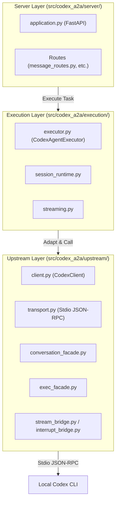

# Maintainer Architecture Guide

This document describes the internal structure, module boundaries, and request call chains of `codex-a2a`. It is intended for maintainers and contributors. Use [architecture.md](./architecture.md) for the higher-level service boundary view and [guide.md](./guide.md) for deployment-facing runtime configuration.

## Core Component Map

## Request Call Chain

### Inbound Message (Send/Stream)

1.  **FastAPI Route**: `POST /v1/message:send` or `POST /v1/message:stream` (or JSON-RPC equivalent).
2.  **Handler**: Validates auth and maps transport-specific payloads into `RequestContext`.
3.  **Executor (`CodexAgentExecutor.execute`)**:
    -   Maps A2A parts to Codex-compatible items.
    -   Resolves workspace directory and session identity.
    -   Calls `SessionRuntime.get_or_create_session`.
4.  **Session Runtime**: Manages `(identity, context_id) -> session_id` mapping and session locks.
5.  **Codex Client (`CodexClient.send_message`)**:
    -   Delegates to `CodexConversationFacade.send_message`.
    -   Facade calls `thread/start` (if new) or `turn/start` via the `Transport`.
    -   Session title hints calculated by the executor are forwarded to `thread/start.name`; blank titles are omitted instead of sending empty metadata upstream.
6.  **Streaming (`consume_codex_stream`)**:
    -   Parallel task that listens to notifications from `StreamEventBridge`.
    -   Maps Codex chunks (text, reasoning, tool_call) to A2A `TaskArtifactUpdateEvent`.
7.  **Response Emitter**: Sends the final `Task` or final status event.

## Module Responsibilities

### Server Layer
-   **`application.py`**: App assembly, middleware (auth, logging), and lifecycle management.
-   **`runtime_state.py`**: Persistence interfaces (TaskStore, SessionState, InterruptStore).

### Execution Layer
-   **`executor.py`**: The main orchestration logic. It doesn't know about stdio; it speaks to a `CodexClient` interface.
-   **`session_runtime.py`**: Handles session continuity, binding, and concurrency (locks).
-   **`streaming.py`**: Logic for consuming the async iterator of events and pushing to the A2A `EventQueue`.

### Upstream Layer
-   **`client.py`**: A coordinator facade that brings together transport, facades, and bridges.
-   **`transport.py`**: Manages the life of the `codex app-server` subprocess and JSON-RPC message exchange.
-   **`conversation_facade.py`**: Translates A2A thread/message concepts to Codex `thread/*` and `turn/*` RPCs.
-   **`exec_facade.py`**: Manages the standalone `command/exec` interactive surface.
-   **`stream_bridge.py`**: Decouples incoming JSON-RPC notifications from specific request/response pairs.
-   **`interrupt_bridge.py`**: Manages the lifecycle of server-initiated requests (asked/replied).

## Key Persistence Points

-   **Task Store**: Stores the final state of A2A tasks.
-   **Session State**: Stores the binding of `context_id` to `session_id`.
-   **Interrupt Store**: Stores pending interrupt requests to survive service restarts.

## Configuration Layering

Configuration is handled in `src/codex_a2a/config.py` using `pydantic-settings`. It is categorized by prefix:

-   `A2A_*`: Settings for the inbound A2A service and outbound A2A client.
-   `CODEX_*`: Settings passed to or used for the local Codex runtime.
