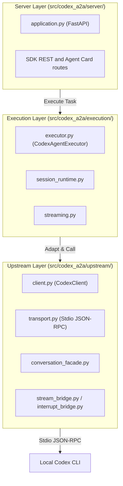

# Maintainer Architecture Guide

This document describes the internal structure, module boundaries, and request call chains of `codex-a2a`. It is intended for maintainers and contributors. Use [architecture.md](./architecture.md) for the higher-level service boundary view and [guide.md](./guide.md) for deployment-facing runtime configuration.

## Core Component Map


```mermaid
flowchart TD
    subgraph Inbound["Server Layer (src/codex_a2a/server/)"]
        App["application.py (FastAPI)"]
        Routes["SDK REST and Agent Card routes"]
    end

    subgraph Execution["Execution Layer (src/codex_a2a/execution/)"]
        Executor["executor.py (CodexAgentExecutor)"]
        SessionRT["session_runtime.py"]
        StreamingRT["streaming.py"]
    end

    subgraph Upstream["Upstream Layer (src/codex_a2a/upstream/)"]
        Client["client.py (CodexClient)"]
        Transport["transport.py (Stdio JSON-RPC)"]
        ConvFacade["conversation_facade.py"]
        Bridge["stream_bridge.py / interrupt_bridge.py"]
    end

    Inbound -->|Execute Task| Execution
    Execution -->|Adapt & Call| Upstream
    Upstream -->|Stdio JSON-RPC| Codex["Local Codex CLI"]
```

## Request Call Chain

### Inbound Message (Send/Stream)

1.  **FastAPI Route**: `POST /message:send` or `POST /message:stream` (or JSON-RPC equivalent).
2.  **Handler**: Validates auth and maps transport-specific payloads into `RequestContext`.
3.  **Executor (`CodexAgentExecutor.execute`)**:
    -   Maps A2A parts to Codex-compatible items.
    -   Resolves workspace directory and session identity.
    -   Calls `SessionRuntime.get_or_create_session`.
4.  **Session Runtime**: Manages `(identity, context_id) -> session_id` mapping and session locks.
5.  **Codex Client (`CodexClient.send_message`)**:
    -   Delegates to `CodexConversationFacade.send_message`.
    -   Facade calls `thread/start` (if new) or `turn/start` via the `Transport`.
    -   Session title hints calculated by the executor are forwarded to `thread/start.name`; blank titles are omitted instead of sending empty metadata upstream.
6.  **Streaming (`consume_codex_stream`)**:
    -   Parallel task that listens to notifications from `StreamEventBridge`.
    -   Maps Codex chunks (text, reasoning, tool_call) to A2A `TaskArtifactUpdateEvent`.
7.  **Response Emitter**: Sends the final `Task` or final status event.

## Module Responsibilities

### Server Layer
-   **`application.py`**: App assembly, middleware (auth, logging), and lifecycle management.
-   **`runtime_state.py`**: Persistence interfaces (TaskStore, SessionState, InterruptStore).

### Execution Layer
-   **`executor.py`**: The main orchestration logic. It doesn't know about stdio; it speaks to a `CodexClient` interface.
-   **`session_runtime.py`**: Handles session continuity, binding, and concurrency (locks).
-   **`streaming.py`**: Logic for consuming the async iterator of events and pushing to the A2A `EventQueue`.

### Upstream Layer
-   **`client.py`**: A coordinator facade that brings together transport, facades, and bridges.
-   **`transport.py`**: Manages the life of the `codex app-server` subprocess and JSON-RPC message exchange.
-   **`conversation_facade.py`**: Translates A2A thread/message concepts to Codex `thread/*` and `turn/*` RPCs.
-   **`client.py` exec helpers**: Manage the standalone `command/exec` interactive surface directly because the mapping stayed too small to justify a dedicated facade module.
-   **`stream_bridge.py`**: Decouples incoming JSON-RPC notifications from specific request/response pairs.
-   **`interrupt_bridge.py`**: Manages the lifecycle of server-initiated requests (asked/replied).

## Key Persistence Points

-   **Task Store**: Stores the final state of A2A tasks.
-   **Session State**: Stores the binding of `context_id` to `session_id`.
-   **Interrupt Store**: Stores pending interrupt requests to survive service restarts.

## Server Shutdown

The ASGI lifespan closes resources in dependency order: request handler, outbound
A2A clients, Codex client, runtime-state store, push-config store, task store, and
finally the shared database engine. Cleanup continues through the remaining
resources if one close operation raises. A startup failure also releases stores
that have already started and the shared engine.

`CodexRequestHandler.aclose()` first drains the SDK's active-task registry through
`DefaultRequestHandler.aclose()`. It also closes the adapter's background-stream
queues immediately, cancels and awaits its producers, and rejects new background
streams after shutdown. This includes discovery, review, interactive exec, and
thread lifecycle watches. Their cleanup runs while clients and stores remain
available; producers already handling cancellation are awaited without another
cancel request that could interrupt their finalizers. Interactive exec also drains
its command and event waiters. Watch and exec iterators explicitly close the
upstream event subscription before producer cleanup finishes.

Shutdown is resource cleanup, not an A2A `CancelTask` request: it does not promise
that every persisted task changes to `CANCELED`, or that unfinished work resumes
after a restart. Producers retain their existing task-state semantics.

For a local lifecycle check without a live Codex process, run:

```bash
uv run pytest --no-cov tests/server/test_request_handler_lifecycle.py tests/execution/test_discovery_exec_runtime.py tests/execution/test_watch_lifecycle.py
```

The lifecycle tests cover active-task draining, startup/close failures, cleanup
ordering, and upstream subscription release.

## SDK Upgrade Acceptance

The adapter uses the SDK's `EventQueueSource` / `EventQueueSink` for background
streams and subclasses the public producer-side `EventQueue` interface. It no
longer uses `EventQueueLegacy` or the legacy consumer/aggregator path. Producers
persist events once before broadcasting; subscriber-specific media projection
never writes back to the task store.

No default sink is created, so an unobserved watch cannot fill an unread queue.
Each remote subscriber has a bounded sink and is detached when it falls behind;
other subscribers and persistence continue. Producer completion allows up to one
second for buffered events to drain before forcing queue closure. A client whose
stream ends before a terminal event can call `GetTask` for the persisted snapshot
and subscribe again while the task remains active.

This is an in-process queue migration. The supported task-store schema and
protobuf payload format are unchanged, so consuming a release containing this
change requires the [standard CLI upgrade](./guide.md#released-cli-self-start)
and an adapter restart, with no database conversion or migration command.

For each SDK pin update, run this offline acceptance suite from a source checkout
with development dependencies installed, then the full validation baseline:

```bash
uv run pytest --no-cov tests/server/test_sdk_upgrade.py
bash ./scripts/validate_baseline.sh
```

The suite treats deprecation warnings as failures and runs against in-memory and
temporary SQLite stores. It verifies early producer failure persistence, terminal
state protection, message history deduplication, replay, single-write broadcasting,
slow/disconnected subscribers, and bounded completion. The committed synthetic SQL
fixture was generated by pre-upgrade `main` revision `0a3fb68` with SDK 1.1.5; it
checks that existing task data can be opened by the upgraded adapter. These tests
run in the normal CI suite and require neither a live Codex process nor a production
database. Repository acceptance is based on these reproducible checks; deployment
monitoring is an operator activity, not an outstanding repository migration.

## Configuration Layering

Configuration is handled in `src/codex_a2a/config.py` using `pydantic-settings`. It is categorized by prefix:

-   `A2A_*`: Settings for the inbound A2A service and outbound A2A client.
-   `CODEX_*`: Settings passed to or used for the local Codex runtime.
